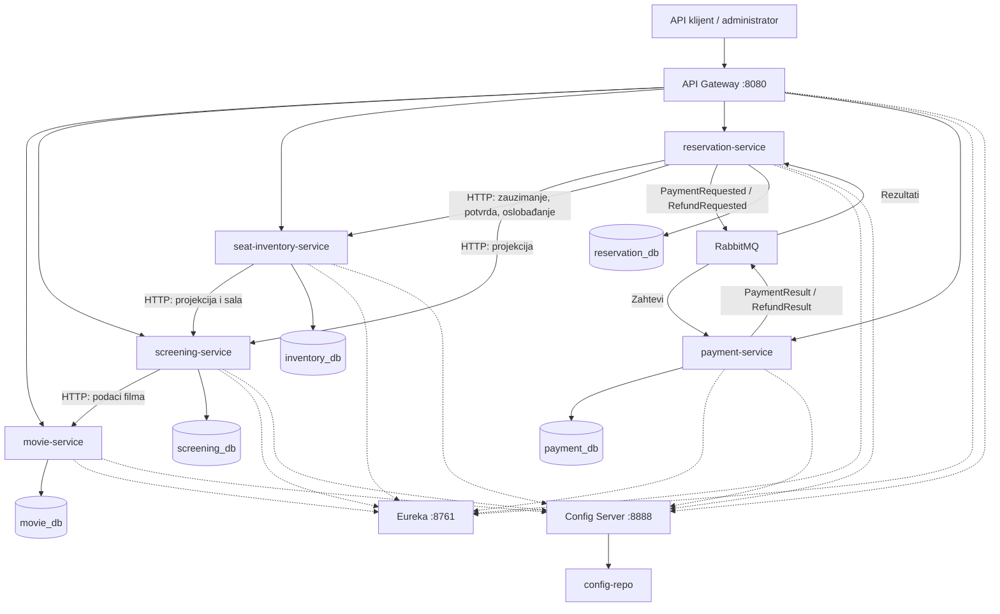

# Cinema Microservices

Mikroservisni sistem za upravljanje bioskopskim repertoarom,
rezervacijama numerisanih sedišta i simuliranim plaćanjima.

Projekat sadrži pet poslovnih mikroservisa, API Gateway,
Eureka discovery server i Spring Cloud Config Server.
Sve izvršne komponente, baze i RabbitMQ pokreću se kroz Docker Compose.

## Obim projekta

- Jedan bioskop sa više sala.
- Filmovi, sale i projekcije.
- Numerisana sedišta i privremeno zauzimanje.
- Rezervacije sa ograničenim rokom plaćanja.
- Simulirano uspešno ili odbijeno plaćanje.
- Simulirani povraćaj novca ako plaćenu rezervaciju nije moguće potvrditi.
- Administratorski pristup za izmene i podatke rezervacija i plaćanja.
- Javan pregled filmova, sala i projekcija.

Nema frontend aplikacije, korisničke registracije, izdavanja QR karata
ni povezivanja sa stvarnim platnim provajderom.

## Poslovni mikroservisi

| Servis | Odgovornost | Interni port |
|---|---|---|
| movie-service | Katalog filmova | 8081 |
| screening-service | Sale, raspored i cene projekcija | 8082 |
| seat-inventory-service | Dostupnost, zauzimanje i potvrda sedišta | 8083 |
| reservation-service | Životni ciklus rezervacije i koordinacija plaćanja | 8084 |
| payment-service | Simulacija naplate i povraćaja novca | 8085 |

Svaki poslovni servis ima sopstvenu PostgreSQL bazu.
Servisi ne pristupaju direktno tuđim bazama.

## Infrastruktura

| Komponenta | Uloga |
|---|---|
| api-gateway | Ulazna tačka, rutiranje, autentifikacija i circuit breaker |
| discovery-server | Eureka registracija i pronalaženje servisa |
| config-server | Centralizovana konfiguracija iz foldera config-repo |
| RabbitMQ | Asinhroni zahtevi i rezultati plaćanja i povraćaja |
| PostgreSQL | Trajno čuvanje poslovnih podataka |

Gateway pronalazi poslovne servise preko Eureke i `lb://` ruta.
Direktni HTTP pozivi između poslovnih servisa koriste Docker DNS adrese.

## Dijagram sistema



Pune strelice prikazuju poslovnu komunikaciju i pristup podacima.
Isprekidane strelice prikazuju registraciju i preuzimanje konfiguracije.

## Poslovni tok

1. Administrator kreira film, salu i buduću projekciju.
2. Screening servis proverava film preko HTTP-a i računa kraj projekcije
   na osnovu trajanja filma.
3. PostgreSQL ograničenje sprečava preklapanje projekcija u istoj sali.
4. Administrator kreira rezervaciju sa UUID identifikatorom i listom sedišta.
5. Reservation servis pribavlja cenu i traži privremeno zauzimanje sedišta.
6. Inventory servis zaključava podatke projekcije u transakciji,
   proverava sva sedišta i zauzima ih zajedno.
7. Rezervacija prelazi u `AWAITING_PAYMENT`.
8. Zahtev za plaćanje upisuje događaj u outbox i menja status u `PAYMENT_PENDING`.
9. Payment servis prima događaj preko RabbitMQ-a, simulira ishod
   i objavljuje rezultat kroz svoj outbox.
10. Uspešno plaćanje vodi u `CONFIRMING`, a potvrda sedišta u `CONFIRMED`.
11. Odbijeno plaćanje vodi u `CANCEL_PENDING`; oslobađanje sedišta
    završava otkazivanje.
12. Ako su sedišta istekla pre potvrde uspešnog plaćanja,
    rezervacija prelazi u `REFUND_PENDING`.
13. Nakon asinhronog povraćaja novca rezervacija i plaćanje imaju `REFUNDED`.

Zauzimanje sedišta traje najviše deset minuta i ne prelazi početak projekcije.
Pozadinski posao oslobađa istekla zauzimanja.
Status rezervacije koja čeka plaćanje usklađuje se i pri njenom čitanju.

## Pouzdanost i konzistentnost

- Lokalna transakcija čuva poslovnu promenu i outbox događaj zajedno.
- Publisher potvrde i provera vraćenih poruka koriste se pri slanju u RabbitMQ.
- Neobjavljeni outbox događaji ponovo se šalju.
- `processed_events` služi za prepoznavanje već obrađenih događaja.
- Jedinstveni identifikatori sprečavaju ponovljenu naplatu iste rezervacije.
- Ponovljen zahtev za rezervaciju sa istim ID-em mora imati iste podatke.
- Nevažeće poruke nakon obrade greške odlaze u dead-letter redove.
- Komunikacija podržava ponovljenu isporuku; ne pretpostavlja se exactly-once.
- Ne postoji distribuirana transakcija preko svih baza:
  tok koristi lokalne transakcije i kompenzaciju povraćajem novca.
- Circuit breaker na Gateway-u ograničava pozive servisima koji otkazuju.
- Pri nedostupnosti Gateway vraća HTTP 503 sa kodom `SERVICE_UNAVAILABLE`.

HTTP timeout ne dokazuje da zahtev za izmenu nije izvršen.
Pre ponavljanja takvog zahteva treba proveriti postojeći rezultat.

## Tehnologije

- Java 21
- Spring Boot 4.1.1
- Spring Cloud 2025.1.3
- Spring Cloud Gateway WebFlux, Eureka i Config
- Spring Security i Resilience4j
- PostgreSQL 17.11 i Flyway migracije
- RabbitMQ 4
- JUnit, Mockito i Testcontainers
- Maven Wrapper
- Docker Compose i PowerShell pipeline

## Preduslovi

- Windows sa PowerShell-om.
- JDK 21: komande `java` i `javac` dostupne kroz PATH.
- Docker Desktop sa Linux kontejnerima i Docker Compose-om.
- Compose verzija koja podržava `!reset` u override fajlovima;
  preporučena je verzija 2.24.4 ili novija.
- Git.

## Preuzimanje i razvojni pipeline

```cmd
git clone https://github.com/evalukac1/cinema-microservices.git
cd cinema-microservices
powershell.exe -NoProfile -ExecutionPolicy Bypass -File .\scripts\pipeline.ps1 -Action All
```

`All` redom:

1. Izvršava `clean verify` za svih osam Java projekata.
2. Proverava Compose konfiguraciju.
3. Pravi Docker slike iz testiranih JAR fajlova.
4. Pokreće kontejnere.
5. Čeka više uspešnih provera kataloških ruta.
6. Izvršava smoke test.

Pipeline se prekida sa nenultim izlaznim kodom ako neki korak padne.

| Akcija | Namena |
|---|---|
| Build | Čist build, testovi i JAR fajlovi |
| Test | Maven verify bez prethodnog clean |
| Deploy | Docker build iz postojećih JAR-ova, pokretanje i smoke test |
| Verify | Provera pokrenutog sistema kroz smoke test |
| All | Ceo razvojni pipeline |
| Stop | Zaustavljanje razvojnog okruženja |

Primer pojedinačne provere:

```cmd
powershell.exe -NoProfile -ExecutionPolicy Bypass -File .\scripts\pipeline.ps1 -Action Verify
```

`Deploy` ne kompajlira izvorni kod: nakon izmene Java koda prvo koristiti
`Build` ili kompletnu akciju `All`.

## Automatski CI — GitHub Actions

Workflow `.github/workflows/ci.yml` pokreće se pri svakom push-u
i pull request-u na `main`, a može se pokrenuti i ručno kroz karticu Actions.

Na GitHub Linux runnerima, za svih osam Java projekata izvršava:

- Maven `clean verify` sa Javom 21;
- testove, uključujući Testcontainers;
- pravljenje Docker slike nakon uspešnih testova;
- čuvanje dostupnih izveštaja testova tokom sedam dana.

Svaki projekat proverava se u zasebnom poslu.
Rezultati i izveštaji dostupni su u kartici Actions.

CI ne objavljuje Docker slike, ne izvršava produkcijski deploy
i ne pokreće smoke test celog sistema.
Lokalni pipeline i produkcijski deploy ostaju dostupni kroz
postojeće PowerShell skripte.

## Razvojne adrese

| Adresa | Namena |
|---|---|
| http://localhost:8080 | Gateway |
| http://localhost:8761 | Eureka |
| http://localhost:8888/movie-service/default | Centralna konfiguracija |
| http://localhost:15672 | RabbitMQ konzola |

Razvojni administrator:

- Korisničko ime: `admin`
- Lozinka: `cinema_local_admin_password`

Razvojni RabbitMQ:

- Korisničko ime: `cinema`
- Lozinka: `cinema_local_password`

Poslovni servisi nemaju objavljene host portove.
Pristup API-ju ide kroz Gateway.

## Primeri API poziva

Javan pregled filmova:

```cmd
curl.exe -i http://localhost:8080/api/movies
```

Administratorski uvid u konfiguracione metapodatke Gateway-a:

```cmd
curl.exe -i -u admin:cinema_local_admin_password http://localhost:8080/actuator/info
```

Glavne rute:

| Metod | Putanja | Namena |
|---|---|---|
| GET / POST | /api/movies | Pregled / kreiranje filmova |
| GET | /api/movies/{id} | Pojedinačni film |
| GET / POST | /api/halls | Pregled / kreiranje sala |
| GET / POST | /api/screenings | Pregled / kreiranje projekcija |
| GET | /api/screenings/{id} | Pojedinačna projekcija |
| GET | /api/inventory/screenings/{id}/seats | Dostupnost sedišta |
| POST | /api/reservations | Kreiranje rezervacije |
| GET | /api/reservations/{id} | Status rezervacije |
| POST | /api/reservations/{id}/pay | Simulirano plaćanje |
| POST | /api/reservations/{id}/cancel | Otkazivanje |
| GET | /api/payments/reservation/{id} | Rezultat plaćanja |

Pregled filmova, sala i projekcija je javan.
Ostale navedene poslovne operacije zahtevaju administratorsku prijavu.

## Produkcijska konfiguracija

Produkcijska konfiguracija koristi:

- `compose.yaml` i `compose.prod.yaml`;
- zaseban Compose projekat `cinema-prod`;
- zasebne baze, volumene i mrežu;
- Spring profil `prod` za poslovne servise i Gateway;
- generisane lozinke iz lokalnog `.env.prod`;
- samo Gateway port objavljen na `127.0.0.1:8080`.

Generisanje lozinki, samo prvi put:

```cmd
powershell.exe -NoProfile -ExecutionPolicy Bypass -File .\scripts\init-prod.ps1
```

Provera ignorisanja tajni:

```cmd
git check-ignore .env.prod
```

Posle uspešnog razvojnog builda i kreiranja Docker slika:

```cmd
powershell.exe -NoProfile -ExecutionPolicy Bypass -File .\scripts\deploy-prod.ps1
```

Skripta proverava konfiguraciju i prisustvo slika, zaustavlja razvojne
kontejnere, pokreće produkcijsko okruženje i izvršava smoke test.
Smoke test pravi demonstracione podatke.

`.env.prod` se ne commit-uje. Sačuvati ga bezbedno:
gubitak ili promena lozinki ne menja automatski lozinke u postojećim bazama.

Produkcijska konfiguracija demonstrirana je lokalno.
Za javno postavljanje potrebno je obezbediti HTTPS, operativne backup-e
i odgovarajuće upravljanje tajnama. Trenutni deploy koristi lokalne Docker
tagove, ne nezavisni registry niti automatski rollback.

## Zaustavljanje i promena okruženja

Zaustavljanje razvoja:

```cmd
docker compose stop
```

Zaustavljanje produkcijskog okruženja:

```cmd
docker compose --env-file .env.prod -p cinema-prod -f compose.yaml -f compose.prod.yaml stop
```

Povratak na razvoj posle zaustavljanja produkcije:

```cmd
docker compose up -d
```

Razvoj i produkcija koriste isti host port 8080, pa ih ne pokretati
istovremeno na ovom računaru.

`stop` čuva podatke. Ne koristiti `down -v` osim kada se namerno brišu
podaci odgovarajućeg okruženja.

## Testiranje

Automatizovane provere uključuju:

- unit testove poslovne logike sa Mockito zavisnostima;
- integracione testove sa zasebnim PostgreSQL Testcontainers bazama;
- API validaciju, nepostojeće resurse i kreiranje podataka;
- preklapanje projekcija;
- konkurentno zauzimanje sedišta i idempotentnost;
- plaćanje, odbijanje i povraćaj novca;
- obradu ponovljenih i neispravnih rezultata;
- autentifikaciju i pristup na Gateway-u.

Smoke test prolazi kroz ceo pokrenuti sistem, uključujući RabbitMQ:

1. Kreira novi film, salu i buduću projekciju.
2. Proverava ponovljen zahtev za istu rezervaciju.
3. Plaća i proverava potvrđenu rezervaciju i sedišta.
4. Simulira odbijanje i proverava otkazivanje.
5. Ponovo rezerviše oslobođena sedišta i otkazuje test rezervaciju.

Ručno su provereni povraćaj nakon isteka sedišta i ponašanje Gateway-a
pri zaustavljanju i oporavku movie servisa.
Aktuelni smoke test ne automatizuje scenario isteka i povraćaja.

Pokretanje samo smoke testa u razvojnom okruženju:

```cmd
powershell.exe -NoProfile -ExecutionPolicy Bypass -File .\scripts\smoke-test.ps1
```

Maven izveštaji nalaze se u `target/surefire-reports` svakog servisa.
Testovi ne koriste razvojne PostgreSQL baze.

## Dijagnostika

Razvojno okruženje:

```cmd
docker compose ps -a
docker compose logs --since=5m --tail=80 api-gateway reservation-service payment-service
```

Produkcijsko okruženje:

```cmd
docker compose --env-file .env.prod -p cinema-prod -f compose.yaml -f compose.prod.yaml ps -a
docker compose --env-file .env.prod -p cinema-prod -f compose.yaml -f compose.prod.yaml logs --since=5m --tail=80 api-gateway reservation-service payment-service
```

Posle pokretanja potrebno je vreme da servisi učitaju konfiguraciju
i da se Eureka registri osveže. `Up` znači da proces radi,
ne nužno da je ceo poslovni tok spreman.

Ako build i deploy prođu, a smoke test padne, proveriti tačan korak i
logove. Ne treba automatski ponavljati sve Maven buildove.

## Ograničenja

- Plaćanje i povraćaj su simulacije.
- Autentifikacija koristi jednog konfigurisanog administratora.
- HTTP Basic namenjen je ovom API demonstracionom okruženju;
  javni transport mora koristiti HTTPS.
- Baze i infrastruktura nisu klasterizovane.
- Config Server koristi filesystem backend povezan read-only volumenom.
- Centralna konfiguracija učitava se pri pokretanju; nije uveden
  automatski refresh svih servisa.
- Nema zasebnog ticket servisa, frontend-a ni opcionalnog monitoringa.
- GitHub Actions automatski izvršava build, testove i proveru pravljenja
  Docker slika pri push-u i pull request-u na main granu.
  Lokalni pipeline i produkcijski deploy pokreću se PowerShell skriptama.
- GitHub čuva kod i konfiguraciju, ali ne podatke Docker volumena.

## Polazni resursi

- Knjiga: Hands-On Microservices with Spring Boot and Spring Cloud.
- Referentni kod:
  https://github.com/PacktPublishing/Hands-On-Microservices-with-Spring-Boot-and-Spring-Cloud
- Prateća video lista:
  https://www.youtube.com/playlist?list=PLeLcvrwLe185prGhjUrFGQsOh_0MArR1P

Projekat primenjuje mikroservisne obrasce na domen bioskopa.